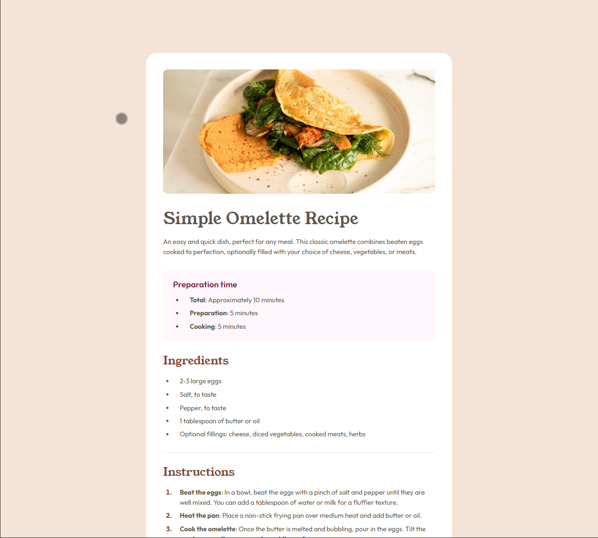
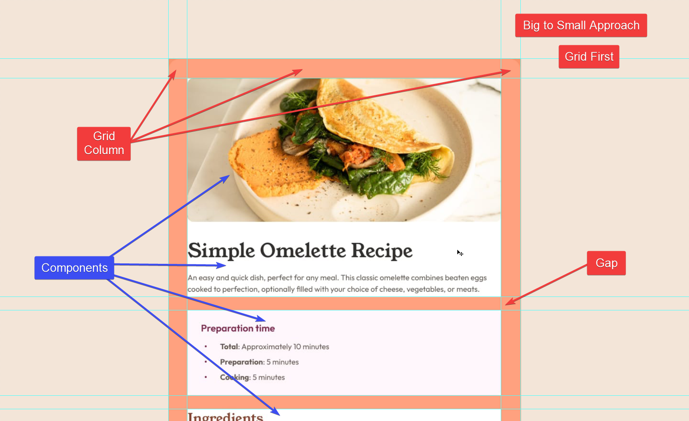

# JeffLangTech - Recipe page solution

This is a solution to the [Recipe page challenge on Frontend Mentor](https://www.frontendmentor.io/challenges/recipe-page-KiTsR8QQKm). 

## Table of contents

- [Overview](#overview)
  - [The challenge](#the-challenge)
  - [Preview](#preview)
  - [Links](#links)
- [My process](#my-process)
  - [Built with](#built-with)
  - [Step by step](#step-by-step)
  - [Continued development](#continued-development)
  - [Useful resources](#useful-resources)
- [Author](#author)

## Overview

### Preview



### Links

- Solution URL: [FrontEnd Mentor Solution](https://www.frontendmentor.io/solutions/css-grid-with-html-templates-and-json-data-loading-D0dMwlJPSb)
- Live Site URL: [Github](https://jefflangtech.github.io/recipe-card/)

## My process

### Built with

- Semantic HTML5 markup
- CSS custom properties
- CSS Grid
- HTML Templates

### Step by step

I went big-to-small when approaching the styling. This was the first time that I tried keeping all the layout rules at the document level (in this case I went grid) and plugged in components that had no margin of their own, only concerned with styling their internal contents. 

I find it helpful to markup a screenshot of the design:


To see how you can add code snippets, see below:

```html
<h1>Some HTML code I'm proud of</h1>
```
```css
.proud-of-this-css {
  color: papayawhip;
}
```
```js
const proudOfThisFunc = () => {
  console.log('🎉')
}
```

### Continued development

Use this section to outline areas that you want to continue focusing on in future projects. These could be concepts you're still not completely comfortable with or techniques you found useful that you want to refine and perfect.

### Useful resources

- [Kevin Powell: 3 underused CSS Grid Features](https://www.youtube.com/watch?v=ciuZJE74wBA) - This wasn't the original video I saw, but he does still explain how to manipulate content across grid columns using named grid lines. I used this to break out the hero image in the mobile view.

## Author

- Website - [JeffLangTech](https://jefflangtech.github.io/)
- Frontend Mentor - [@jefflangtech](https://www.frontendmentor.io/profile/jefflangtech)